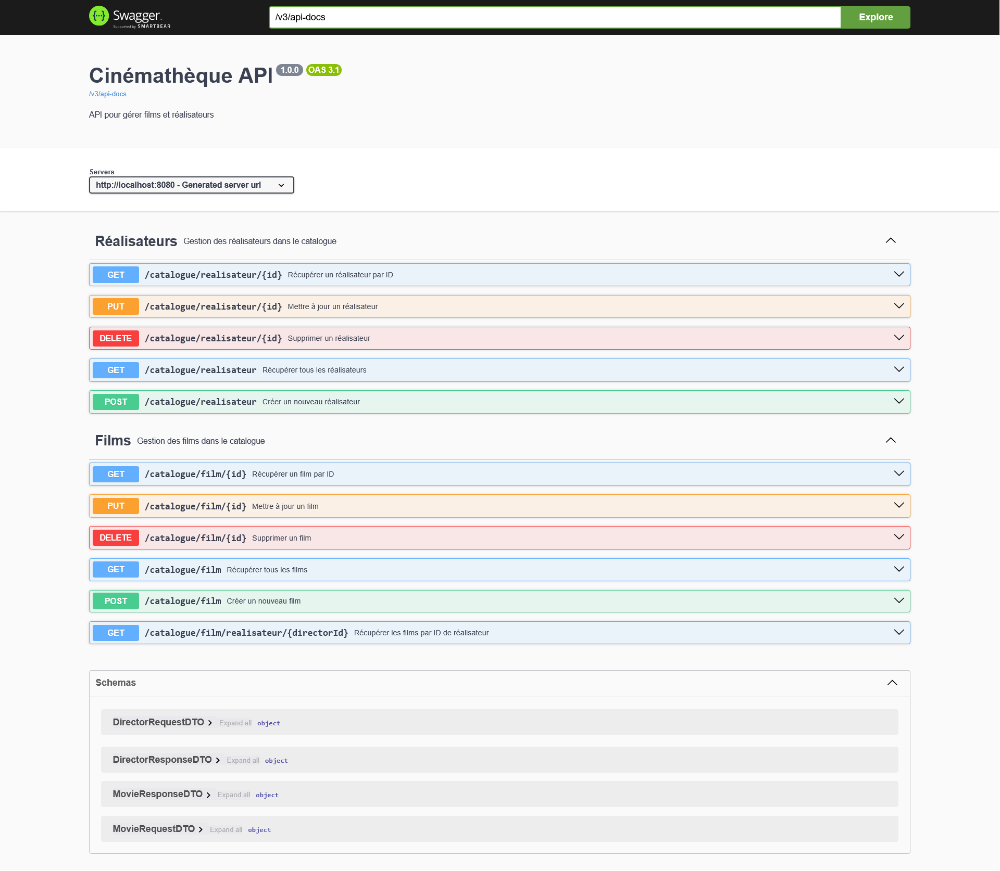
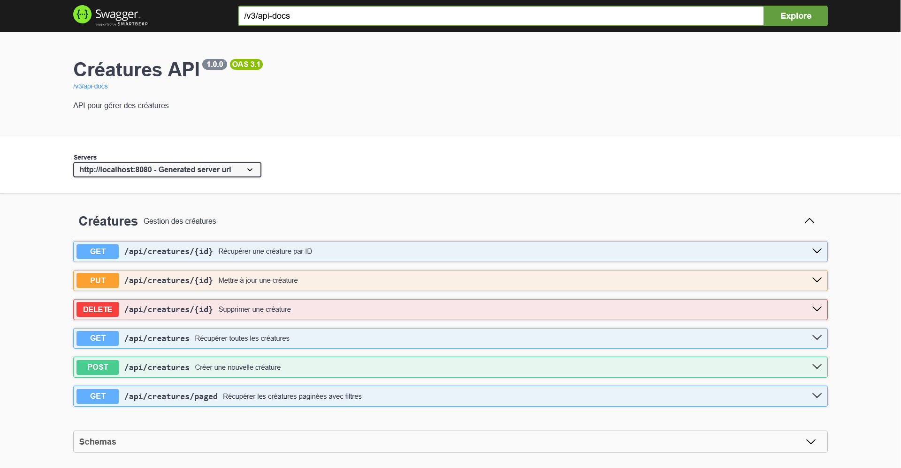

# 🌱 Spring - Exercices

## 📅 Période de cours : 18/08/2025 → 22/08/2025

Ce repository regroupe les exercices réalisés dans le cadre de l’apprentissage de **Spring**. Chaque exercice possède son propre dossier et code source.

---

## 📘 Exercices

### 📝 Exercice 1 — Todo API

#### 🎯 Objectif

Développer une **API REST** permettant de gérer une liste de tâches (**ToDo**) avec un CRUD complet.

#### 📂 Modèle : `Todo`

* `id` : Identifiant unique *(Long)*
* `titre` : Titre de la tâche *(String)*
* `description` : Description détaillée *(String)*
* `date` : Date associée *(LocalDate, ex. `2025-08-19`)*
* `isValidate` : Statut de validation *(Boolean)*

#### ⚙️ Fonctionnalités attendues

* ➕ **Créer** un todo
* 🗑️ **Supprimer** un todo
* ✏️ **Modifier** un todo
* 🔍 **Récupérer** un todo par `id`
* 📋 **Lister** tous les todos
* ✅ **Lister** les todos **validés**
* ❌ **Lister** les todos **non validés**

---

### 🎬 Exercice 2 — API REST « Cinémathèque »

#### 🎯 Objectif

Créer une application **Cinémathèque** permettant de gérer un catalogue de **films** et de **réalisateurs** avec un CRUD complet et des routes de consultation.

#### 📂 Modèles

**Film**

* `id` : Identifiant unique *(Long)*
* `nom` : Titre du film *(String)*
* `dateSortie` : Date de sortie *(LocalDate)*
* `description` : Synopsis du film *(String)*
* `duree` : Durée du film *(int, en minutes)*
* `genre` : Genre cinématographique *(String)*
* `realisateur` : Réalisateur associé *(Relation ManyToOne)*

**Réalisateur**

* `id` : Identifiant unique *(Long)*
* `nom` : Nom de famille *(String)*
* `prenom` : Prénom *(String)*
* `dateNaissance` : Date de naissance *(LocalDate)*
* `nationalite` : Nationalité *(String)*

#### ⚙️ Fonctionnalités attendues

* CRUD complet sur les **films**
* CRUD complet sur les **réalisateurs**
* Récupérer la liste des films
* Récupérer un film par son `id`
* Récupérer la liste des réalisateurs
* Récupérer un réalisateur par son `id`
* Récupérer les films associés à un réalisateur

#### 📡 Routes attendues

* `GET /catalogue/films` → Lister tous les films
* `GET /catalogue/realisateur` → Lister tous les réalisateurs
* `GET /catalogue/film/{id}` → Détails d’un film
* `GET /catalogue/realisateur/{id}` → Détails d’un réalisateur
* `GET /catalogue/realisateur/{id}/films` → Liste des films réalisés par ce réalisateur

#### 📸 Capture d'écran


---

### 🐉 Exercice 4 — API REST « Creatures »

#### 🎯 Objectif

Créer une petite API REST avec **Spring Boot** pour manipuler des **créatures**, avec un CRUD complet, la **pagination** et la **validation** des résultats.

#### 📂 Modèle : 

**Créature**

* `id : Long`
* `name : String`
* `age : int`
* `weight : double`
* `dangerous : boolean`
* `type : CreatureType` (enum : `DRAGON, ELF, DWARF, ORC, HUMAN`)

#### 📡 Endpoints attendus

* **POST** `/api/creatures` → créer une créature
* **GET** `/api/creatures` → récupérer toutes les créatures
* **GET** `/api/creatures/{id}` → récupérer une créature par son id
* **PUT** `/api/creatures/{id}` → mettre à jour une créature
* **DELETE** `/api/creatures/{id}` → supprimer une créature
* **GET** `/api/creatures/paged?page=0&size=5` → récupérer les créatures avec pagination

#### ⭐ Bonus

* **GET** `/api/creatures/paged?page=0&size=5&sortField=age&direction=asc` → récupérer les créatures avec pagination et tri

#### 📸 Capture d'écran


---


## 🧰 Stack & Prérequis

* **Java 17+**
* **Maven 3+**
* **Spring Boot 3+**
* **Docker & Docker Compose**
* **MySQL** (via conteneur)

> Ports par défaut : Application `:8080`, MySQL `:3307`.

---

## 🚀 Démarrage rapide

### 1) Cloner le repository

```bash
git clone https://github.com/AxelDemeyere/Spring-cours.git
```

### 2) Lancer la BDD (MySQL)

```bash
docker compose up -d
```

> Cela démarre notamment un conteneur **MySQL** nommé `springboot_mysql`.

### 3) Créer la base de données `exercices`

Se connecter au conteneur MySQL :

```bash
docker exec -it springboot_mysql mysql -u root -p
# Mot de passe : password
```

Dans le client MySQL :

```sql
CREATE DATABASE exercices;
SHOW DATABASES;
```
